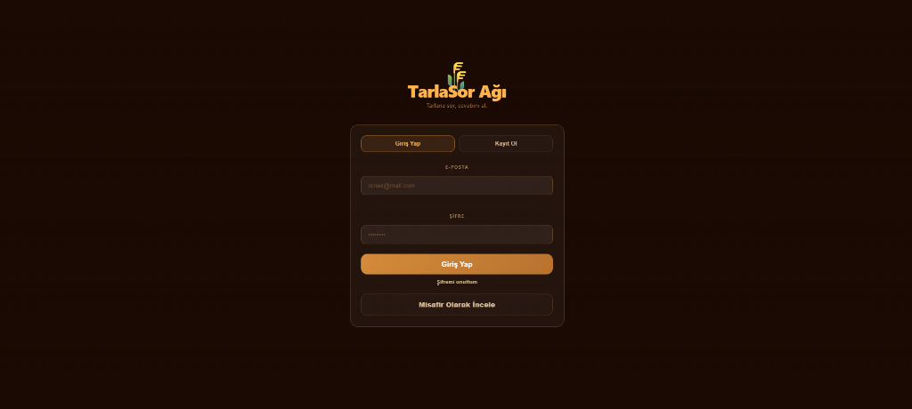
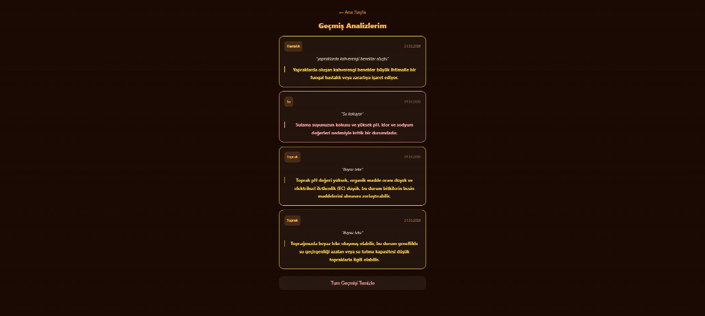
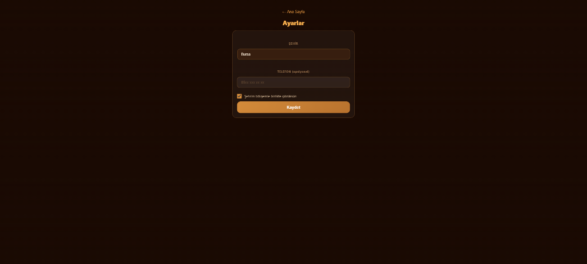
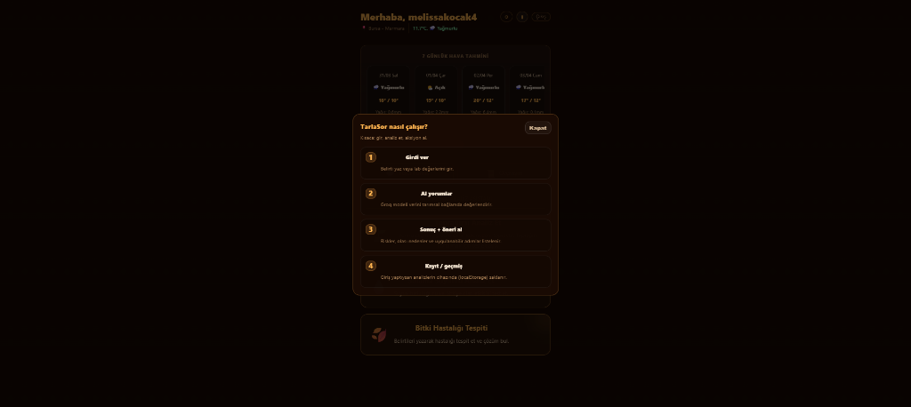
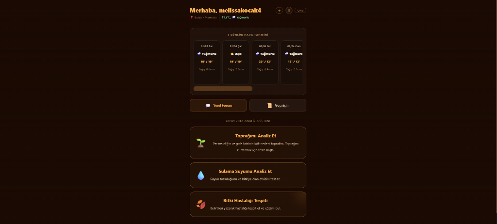

# TarlaSor UI Assets

Bu dosya, TarlaSor projesinin temel ekran görüntülerini ve kullanıcı arayüzü (UI) varlıklarını sırayla listelemek için oluşturulmuştur. Tüm görseller `src/assets/` klasöründen çekilmektedir.

## 1. Kayıt / Giriş Ekranı (Login & Register)
*Kullanıcıların sisteme giriş yaptığı veya yeni hesap oluşturduğu karşılama ekranı.*
- **Dosya Yolu:** `src/assets/login.png`
- **Görsel:** 
  

## 2. Geçmiş Analizlerim (History)
*Daha önce yapılan toprak, su veya hastalık analizlerinin tarihe göre listelendiği geçmiş sekmesi.*
- **Dosya Yolu:** `src/assets/history.png`
- **Görsel:**
  

## 3. Ayarlar (Settings)
*Kullanıcının şehir, telefon ve gizlilik tercihlerini yönettiği ayarlar menüsü.*
- **Dosya Yolu:** `src/assets/settings.png`
- **Görsel:**
  

## 4. TarlaSor Nasıl Çalışır? (Info/Onboarding)
*Kullanıcılara sistemin 4 adımda nasıl analiz yaptığını anlatan bilgilendirme ekranı.*
- **Dosya Yolu:** `src/assets/info.png`
- **Görsel:**
  

## 5. Ana Sayfa & Dashboard (Main)
*Hava durumu tahmini, analiz butonları ve yerel forumun bulunduğu ana kontrol paneli.*
- **Dosya Yolu:** `src/assets/dashboard.png`
- **Görsel:**
  

---
